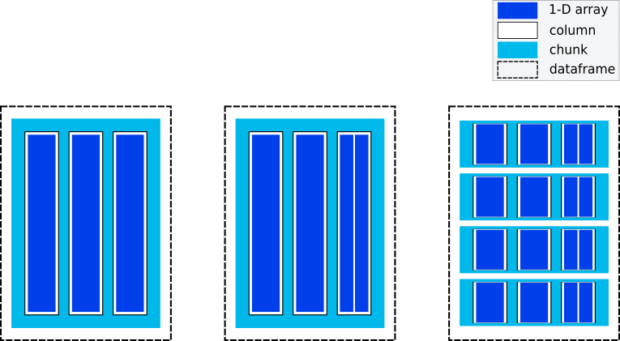

# `__dataframe__` protocol - summary

_We've had a lot of discussion in a couple of GitHub issues and in meetings.
This description attempts to summarize that, and extract the essential design
requirements/principles and functionality it needs to support._

## Purpose of `__dataframe__`

The purpose of `__dataframe__` is to be a _data interchange_ protocol. I.e.,
a way to convert one type of dataframe into another type (for example,
convert a Koalas dataframe into a Pandas dataframe, or a cuDF dataframe into
a Vaex dataframe).

Currently (Nov'20) there is no way to do this in an implementation-independent way.

The main use case this protocol intends to enable is to make it possible to
write code that can accept any type of dataframe instead of being tied to a
single type of dataframe. To illustrate that:

```python
def somefunc(df, ...):
    """`df` can be any dataframe supporting the protocol, rather than (say)
    only a pandas.DataFrame"""
    # could also be `cudf.from_dataframe(df)`, or `vaex.from_dataframe(df)`
    # note: this should throw a TypeError if it cannot be done without a device
    # transfer (e.g. move data from GPU to CPU) - add `force=True` in that case
    new_pandas_df = pd.from_dataframe(df)
    # From now on, use Pandas dataframe internally
```

### Non-goals

Providing a _complete standardized dataframe API_ is not a goal of the
`__dataframe__` protocol. Instead, this is a goal of the full dataframe API
standard, which the Consortium for Python Data API Standards aims to provide
in the future. When that full API standard is implemented by dataframe
libraries, the example above can change to:

```python
def get_df_module(df):
    """Utility function to support programming against a dataframe API"""
    if hasattr(df, '__dataframe_namespace__'):
       # Retrieve the namespace 
       pdx = df.__dataframe_namespace__()  
    else:
        # Here we can raise an exception if we only want to support compliant dataframes,
        # or convert to our default choice of dataframe if we want to accept (e.g.) dicts
        pdx = pd
        df = pd.DataFrame(df)

    return pdx, df


def somefunc(df, ...):
    """`df` can be any dataframe conforming to the dataframe API standard"""
    pdx, df = get_df_module(df)
    # From now on, use `df` methods and `pdx` functions/objects
```

### Constraints

An important constraint on the `__dataframe__` protocol is that it should not
make achieving the goal of the complete standardized dataframe API more
difficult to achieve.

There is a small concern here. Say that a library adopts `__dataframe__` first,
and it goes from supporting only Pandas to officially supporting other
dataframes like `modin.pandas.DataFrame`. At that point, changing to
supporting the full dataframe API standard as a next step _implies a
backwards compatibility break_ for users that now start relying on Modin
dataframe support. E.g., the second transition will change from returning a
Pandas dataframe from `somefunc(df_modin)` to returning a Modin dataframe
later. It must be made very clear to libraries accepting `__dataframe__` that
this is a consequence, and that that should be acceptable to them.


### Progression / timeline

- **Current status**: most dataframe-consuming libraries work _only_ with
  Pandas, and rely on many Pandas-specific functions, methods and behavior.
- **Status after `__dataframe__`**: with minor code changes (as in first
  example above), libraries can start supporting all conforming dataframes,
  convert them to Pandas dataframes, and still rely on the same
  Pandas-specific functions, methods and behavior.
- **Status after standard dataframe API adoption**: libraries can start
  supporting all conforming dataframes _without converting to Pandas or
  relying on its implementation details_. At this point, it's possible to
  "program to an interface" rather than to a specific library like Pandas.


## Conceptual model of a dataframe

For a protocol to exchange dataframes between libraries, we need both a model of what we mean by "dataframe" conceptually for the purposes of the protocol, and a model of how the data is represented in memory:



The smallest building block are **1-D arrays**, which are contiguous in
memory and contain data with the same dtype. A **column** consists of one or
more 1-D arrays (if, e.g., missing data is represented with a boolean mask,
that's a separate array). A **chunk** contains a set of columns of uniform
length. A **dataframe** contains one or more chunks.


## Protocol design requirements

1. Must be a standard Python-level API that is unambiguously specified, and
   not rely on implementation details of any particular dataframe library.
2. Must treat dataframes as a collection of columns (which are conceptually
   1-D arrays with a dtype and missing data support).
   _Note: this relates to the API for `__dataframe__`, and does not imply
   that the underlying implementation must use columnar storage!_
3. Must allow the consumer to select a specific set of columns for conversion.
4. Must allow the consumer to access the following "metadata" of the dataframe:
   number of rows, number of columns, column names, column data types.
   _Note: this implies that a data type specification needs to be created._
   _Note: column names are required; they must be strings and unique. If a
   dataframe doesn't have them, dummy ones like `'0', '1', ...` can be used._
5. Must include device support.
6. Must avoid device transfers by default (e.g. copy data from GPU to CPU),
   and provide an explicit way to force such transfers (e.g. a `force=` or
   `copy=` keyword that the caller can set to `True`).
7. Must be zero-copy if possible.
8. Must support missing values (`NA`) for all supported dtypes.
9. Must supports string, categorical and datetime dtypes.
10. Must allow the consumer to inspect the representation for missing values
    that the producer uses for each column or data type.
    _Rationale: this enables the consumer to control how conversion happens,
    for example if the producer uses `-128` as a sentinel value in an `int8`
    column while the consumer uses a separate bit mask, that information
    allows the consumer to make this mapping._
11. Must allow the producer to describe its memory layout in sufficient
    detail. In particular, for missing data and data types that may have
    multiple in-memory representations (e.g., categorical), those
    representations must all be describable in order to let the consumer map
    that to the representation it uses.
    _Rationale: prescribing a single in-memory representation in this
    protocol would lead to unnecessary copies being made if that represention
    isn't the native one a library uses._
    _Note: the memory layout is columnnar. Row-major dataframes can use this
    protocol, but not in a zero-copy fashion (see requirement 2 above)._
12. Must support chunking, i.e. accessing the data in "batches" of rows.
    There must be metadata the consumer can access to learn in how many
    chunks the data is stored. The consumer may also convert the data in
    more chunks than it is stored in, i.e. it can ask the producer to slice its columns to shorter length. That request may not be such that it would force the producer
    to concatenate data that is already stored in separate chunks.
    _Rationale: support for chunking is more efficient for libraries that natively store chunks, and it is needed for dataframes that do not fit in memory (e.g. dataframes stored on disk or lazily evaluated)._

We'll also list some things that were discussed but are not requirements:

1. Object dtype does not need to be supported
2. Nested/structured dtypes within a single column does not need to be
   supported.
   _Rationale: not used a lot, additional design complexity not justified.
   May be added in the future (does have support in the Arrow C Data
   Interface). Also note that Arrow and NumPy structured dtypes have
   different memory layouts, e.g. a `(float, int)` dtype would be stored as
   two separate child arrays in Arrow and as a single `f0, i0, f1, i1, ...`
   interleaved array in NumPy._
3. Extension dtypes, i.e. a way to extend the set of dtypes that is
   explicitly support, are out of scope.
   _Rationale: complex to support, not used enough to justify that complexity._
4. "virtual columns", i.e. columns for which the data is not yet in memory
   because it uses lazy evaluation, are not supported other than through
   letting the producer materialize the data in memory when the consumer
   calls `__dataframe__`.
   _Rationale: the full dataframe API will support this use case by
   "programming to an interface"; this data interchange protocol is
   fundamentally built around describing data in memory_.

### To be decided

_The connection between dataframe and array interchange protocols_. If we
treat a dataframe as a set of columns which each are a set of 1-D arrays
(there may be more than one in the case of using masks for missing data, or
in the future for nested dtypes), it may be expected that there is a
connection to be made with the array data interchange method. The array
interchange is based on DLPack; its major limitation from the point of view
of dataframes is the lack of support of all required data types (string,
categorical, datetime) and missing data. A requirement could be added that
`__dlpack__` should be supported in case the data types in a column are
supported by DLPack. Missing data via a boolean mask as a separate array
could also be supported.

_Should there be a standard `from_dataframe` constructor function?_ This
isn't completely necessary, however it's expected that a full dataframe API
standard will have such a function. The array API standard also has such a
function, namely `from_dlpack`. Adding at least a recommendation on syntax
for this function would make sense, e.g., `from_dataframe(df, stream=None)`.
Discussion at https://github.com/data-apis/dataframe-api/issues/29#issuecomment-685903651 is relevant.


## Frequently asked questions

### Can the Arrow C Data Interface be used for this?

What we are aiming for is quite similar to the Arrow C Data Interface (see
the [rationale for the Arrow C Data Interface](https://arrow.apache.org/docs/format/CDataInterface.html#rationale)),
except `__dataframe__` is a Python-level rather than C-level interface.
The data types format specification of that interface is something that could be used unchanged.

The main (only?) limitation seems to be that it does not have device support
- @kkraus14 will bring this up on the Arrow dev mailing list. Also note that
that interface only talks about arrays; dataframes, chunking and the metadata
inspection can all be layered on top in this Python-level protocol, but are
not discussed in the interface itself.

Note that categoricals are supported, Arrow uses the phrasing
"dictionary-encoded types" for categorical.

The Arrow C Data Interface says specifically it was inspired by [Python's
buffer protocol](https://docs.python.org/3/c-api/buffer.html), which is also
a C-only and CPU-only interface. See `__array_interface__` below for a
Python-level equivalent of the buffer protocol.

Note that specifying the precise semantics for implementers (both producing
and consuming libraries) will be important. The Arrow C Data interface relies
on providing a deletion / finalization method similar to DLPack. The desired
semantics here need to be ironed out. See Arrow docs on
[release callback semantics](https://arrow.apache.org/docs/format/CDataInterface.html#release-callback-semantics-for-consumers).


### Is `__dataframe__` analogous to `__array__` or `__array_interface__`?

Yes, it is fairly analogous to `__array_interface__`. There will be some
differences though, for example `__array_interface__` doesn't know about
devices, and it's a `dict` with a pointer to memory so there's an assumption
that the data lives in CPU memory (which may not be true, e.g. in the case of
cuDF or Vaex).

It is _not_ analogous to `__array__`, which is NumPy-specific. `__array__` is a
method attached to array/tensor-like objects, and calling it is requesting
the object it's attached to to turn itself into a NumPy array. Hence, the
library that implements `__array__` must depend (optionally at least) on
NumPy, and call a NumPy `ndarray` constructor itself from within `__array__`.


### What is wrong with `.to_numpy?` and `.to_arrow()`? 

Such methods ask the object it is attached to to turn itself into a NumPy or
Arrow array. Which means each library must have at least an optional
dependency on NumPy and on Arrow if it implements those methods. This leads
to unnecessary coupling between libraries, and hence is a suboptimal choice -
we'd like to avoid this if we can.

Instead, it should be dataframe consumers that rely on NumPy or Arrow, since
they are the ones that need such a particular format. So, it can call the
constructor it needs. For example, `x = np.asarray(df['colname'])` (where
`df` supports `__dataframe__`).


### Does an interface describing memory work for virtual columns?

Vaex is an example of a library that can have "virtual columns" (see @maartenbreddels
[comment here](https://github.com/data-apis/dataframe-api/issues/29#issuecomment-686373569)).
If the protocol includes a description of data layout in memory, does that
work for such a virtual column?

Yes. Virtual columns need to be materialized in memory before they can be
turned into a column for a different type of dataframe - that will be true
for every discussed form of the protocol; whether there's a `to_arrow()` or
something else does not matter. Vaex can choose _how_ to materialize (e.g.,
to an Arrow array, a NumPy array, or a raw memory buffer) - as long as the
returned description of memory layout is valid, all those options can later
be turned into the desired column format without a data copy, so the
implementation choice here really doesn't matter much.

_Note: the above statement on materialization assumes that there are many
forms a virtual column can be implemented, and that those are all
custom/different and that at this point it makes little sense to standardize
that. For example, one could do this with a simple string DSL (`'col_C =
col_A + col_B'`, with a fancier C++-style lazy evaluation, with a
computational graph approach like Dask uses, etc.)._


## Possible direction for implementation

### Rough prototypes

The `cuDFDataFrame`, `cuDFColumn` and `cuDFBuffer` sketched out by @kkraus14
[here](https://github.com/data-apis/dataframe-api/issues/29#issuecomment-685123386)
seems to be in the right direction.

[This prototype](https://github.com/wesm/dataframe-protocol/pull/1) by Wes
McKinney was the first attempt, and has some useful features.

TODO: work this out after making sure we're all on the same page regarding requirements.


### Relevant existing protocols

Here are the four most relevant existing protocols, and what requirements they support:

| *supports*          | buffer protocol | `__array_interface__` | DLPack | Arrow C Data Interface |
|---------------------|:---------------:|:---------------------:|:------:|:----------------------:|
| Python API          |                 |           Y           |   (1)  |                        |
| C API               |        Y        |           Y           |    Y   |            Y           |
| arrays              |        Y        |           Y           |    Y   |            Y           |
| dataframes          |                 |                       |        |                        |
| chunking            |                 |                       |        |                        |
| devices             |                 |                       |    Y   |                        |
| bool/int/uint/float |        Y        |           Y           |    Y   |            Y           |
| missing data        |       (2)       |          (3)          |   (4)  |            Y           |
| string dtype        |       (4)       |          (4)          |        |            Y           |
| datetime dtypes     |                 |          (5)          |        |            Y           |
| categoricals        |       (6)       |          (6)          |   (7)  |           (6)          |

1. The Python API is only an interface to call the C API under the hood, it
   doesn't contain a description of how the data is laid out in memory.
2. Can be done only via separate masks of boolean arrays.
3. `__array_interface__` has a `mask` attribute, which is a separate boolean array also implementing the `__array_interface__` protocol.
4. Only fixed-length strings as sequence of char or unicode.
5. Only NumPy datetime and timedelta, which are limited compared to what the Arrow format offers.
6. No explicit support, however categoricals can be mapped to either integers
   or strings. Unclear how to communicate that information from producer to consumer.
7. No explicit support, categoricals can only be mapped to integers.

| *implementation*    | buffer protocol | `__array_interface__` |  DLPack   | Arrow C Data Interface |
|---------------------|:---------------:|:---------------------:|:---------:|:----------------------:|
| refcounting         |        Y        |           Y           |           |                        |
| call deleter        |                 |                       |    Y      |            Y           |
| supporting C code   |   in CPython    |       in NumPy        | spec-only |         spec-only      |

It is worth noting that for all four protocols, both dataframes and chunking
can be easily layered on top. However only arrays, which are the only parts
that have a specific memory layout, are explicitly specified in all those
protocols. For Arrow this would be a little easier than for other protocols
given the inclusion of "children" and "dictionary-encoded types", and indeed
PyArrow already does provide such functionality.


## References

[Python buffer protocol][https://docs.python.org/3/c-api/buffer.html]

[`__array_interface__` protocol][https://numpy.org/devdocs/reference/arrays.interface.html]

[Arrow C Data Interface][https://arrow.apache.org/docs/format/CDataInterface.html]

[DLPack][https://github.com/dmlc/dlpack]

[Array data interchange in API standard][https://data-apis.github.io/array-api/latest/design_topics/data_interchange.html]